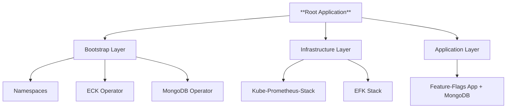

# Feature Flags Resources

This repository contains the **infrastructure manifests** for deploying [**Feature Flags App**](https://github.com/shaarron/feature-flags-app). 


**Feature Flags App** running on **Amazon EKS**, managed with **Argo CD** and **Helm**, following modern GitOps principles - “App-of-Apps” pattern.

**Components overview**
- **Core App**: Feature Flags API (with MongoDB & Nginx) 
- **Monitoring**: Kube-Prometheus-Stack (Prometheus, Grafana)  
- **Logging**: EFK Stack (Elasticsearch, Fluent Bit, Kibana)


## Table Of Contents
- [Feature Flags Resources](#feature-flags-resources)
  - [Table Of Contents](#table-of-contents)
  - [Argocd Deployment Flow](#argocd-deployment-flow)
  - [Stack Components order](#stack-components-order)
  - [Argocd directory structure](#argocd-directory-structure)
  - [Grafana Dashboard: Feature Flags API Monitoring](#grafana-dashboard-feature-flags-api-monitoring)
  - [Deploy Locally](#deploy-locally)
    - [Login to argocd CLI](#login-to-argocd-cli)
    - [Login trough UI](#login-trough-ui)


## Argocd Deployment Flow




## Stack Components order

| Component               | Namespace        | Sync Wave | Notes |
|-------------------------|------------------|-----------|-------|
| Namespaces             | `argocd`         | `0`       | Ensures required namespaces exist |
| MongoDB Operator       | `mongodb`        | `0`       | Installs MongoDB Community Operator |
| ECK Operator           | `elastic-system` | `0`       | Deploys ECK operator for Elasticsearch & Kibana |
| Kube Prometheus Stack  | `kps`            | `1`       | Metrics stack (Prometheus, Grafana, etc.) |
| EFK Stack              | `efk`            | `2`       | Fluent Bit → Elasticsearch → Kibana |
| Feature Flags API      | `default`        | `3`       | Flask-based API for toggling flags |

---

## Argocd directory structure
 
1. **Bootstrap**
   - Create namespaces
   - Install ECK operator + crds
   - Install MongoDB operator + crds
 

2. **Infrastructure**
   - Deploy **kube-prometheus-stack** (**kps** namespace)
   - Deploy **EFK** (**efk** namespace)
     - [ECK](https://www.elastic.co/docs/deploy-manage/deploy/cloud-on-k8s) (**Elasic Cloud Kubernetes** - for Elasticsearch & kibana) 
     - Fluent Bit 

3. **Applications**
   - Deploy **Feature-Flags API** + MongoDB  
 
## Grafana Dashboard: Feature Flags API Monitoring
This Grafana dashboard monitors the Feature Flags API on Kubernetes.
Provisioned via the kube-prometheus-stack Helm chart (ConfigMap: ```feature-flags-grafana-dashboards```), it combines Flask app metrics (```prometheus_flask_exporter```) with Kubernetes metrics from Prometheus to visualize traffic, performance, and resource usage.


| **Panel**              | **Metric**                                                                                     | **Description**                                                                                     |
|-------------------------|-----------------------------------------------------------------------------------------------|-----------------------------------------------------------------------------------------------------|
| **HTTP Request Rate**   | `rate(flask_http_request_total[5m])`                                                          | Displays the rate of incoming HTTP requests handled by the Flask API over the last 5 minutes. Useful for understanding load and usage patterns. |
| **HTTP Error Rate (5xx)** | `rate(flask_http_request_total{status=~"5.."}[5m])`                                          | Shows the rate of server-side errors (5xx) to detect application or backend failures.               |
| **Response Time (p95)** | `histogram_quantile(0.95, rate(flask_http_request_duration_seconds_bucket[5m]))`              | Indicates the 95th percentile response time of API requests, representing typical user latency under load. |
| **Pod CPU Usage**       | `rate(container_cpu_usage_seconds_total{pod=~"flask-app.*"}[5m])`                             | Monitors CPU utilization of the Flask application pods to identify performance or scaling issues.   |
| **Pod Memory Usage**    | `container_memory_usage_bytes{pod=~"flask-app.*"} / 1024 / 1024`                              | Tracks memory consumption (in MB) of each Flask application pod to detect memory leaks or resource exhaustion. |


## Deploy Locally


```sh
# Install Argo CD (if not already installed)
kubectl create namespace argocd

kubectl apply -n argocd -f https://raw.githubusercontent.com/argoproj/argo-cd/stable/manifests/install.yaml
t
# Apply the root app
kubectl apply -f argocd/root-app.yaml -n argocd

# Verify
kubectl get ns
kubectl get pods -A
kubectl get ingress -A

```

### Login to argocd CLI

```sh
# Get the password
kubectl -n argocd get secret argocd-initial-admin-secret \
  -o jsonpath="{.data.password}" | base64 -d; echo

# Login with the password from above
argocd login localhost:8080 --username admin --password <PASSWORD> --insecure
```
### Login trough UI 
```sh
# Port forward 
 kubectl port-forward svc/argocd-server -n argocd 8080:443 

# Get the password 
kubectl -n argocd get secret argocd-initial-admin-secret \
  -o jsonpath="{.data.password}" | base64 -d; echo

# Open argocd UI
# Login with admin user and the retrieved password
http://localhost:8080

```

