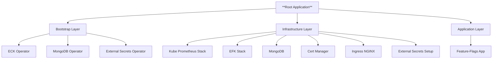
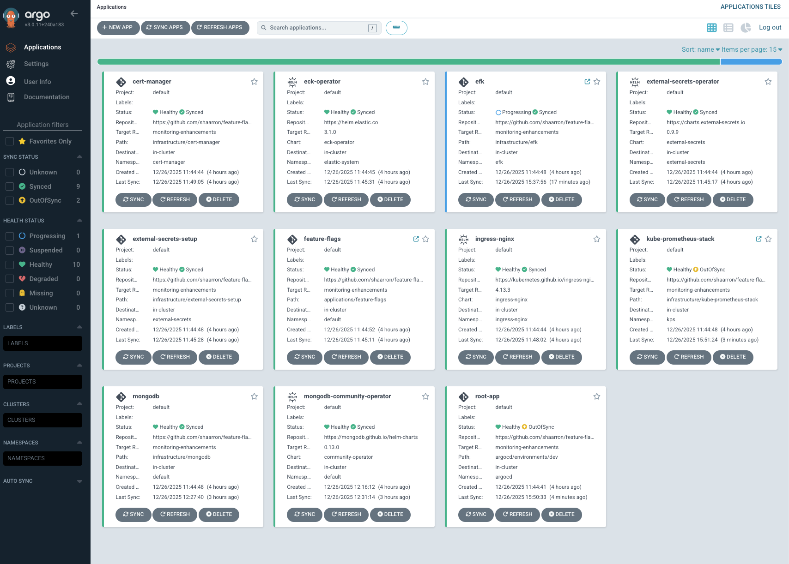
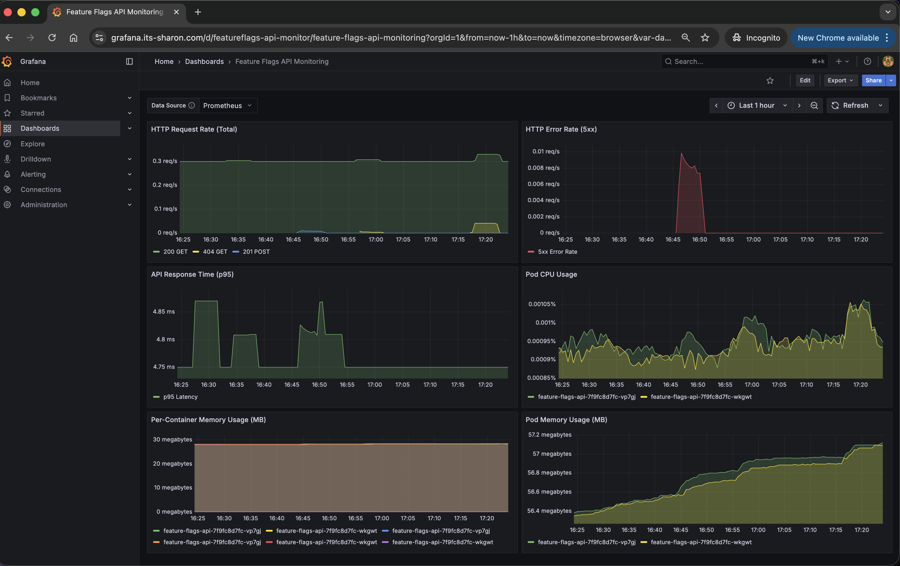
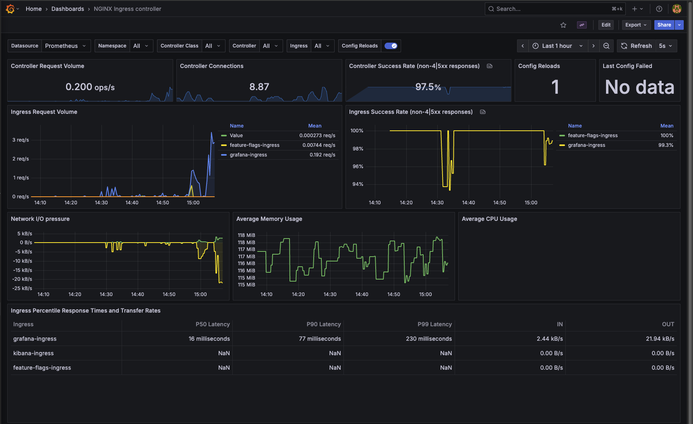
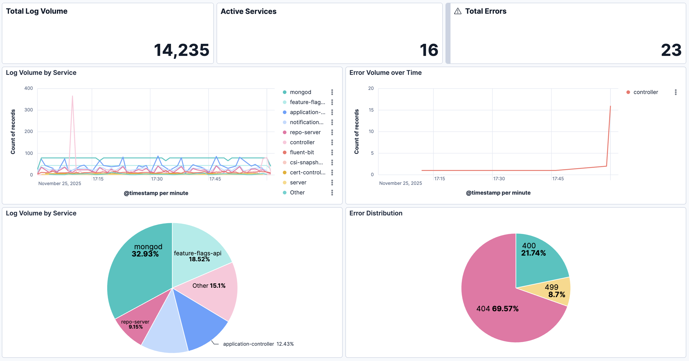

# Feature Flags Resources

This repository contains the **infrastructure manifests** for deploying [**Feature Flags App**](https://github.com/shaarron/feature-flags-app). 


**Feature Flags App** running on **Amazon EKS**, managed with **Argo CD** and **Helm**, following modern GitOps principles - “App-of-Apps” pattern.

**Components overview**
- **Core App**: Feature Flags API (with MongoDB) 
- **Monitoring**: Kube-Prometheus-Stack (Prometheus, Grafana)  
- **Logging**: EFK Stack (Elasticsearch, Fluent Bit, Kibana)


## Table Of Contents
  - **[Argocd Deployment Flow](#argocd-deployment-flow)**
  - **[Sync waves](#sync-waves)**
  - **[Argocd Applications Structure](#argocd-applications-structure)**
  - **[Grafana Dashboard: Feature Flags API](#grafana-dashboard-feature-flags-api-monitoring)**
  - **[Grafana Dashboard: Nginx Ingress Controller](#grafana-dashboard-nginx-ingress-controller-dashboard)**
  - **[Kibana Dashboard: Feature Flags API](#kibana-dashboard-feature-flags-dashboard)**
  - **[Deploy Locally](#deploy-locally)**

## Argocd Deployment Flow




## Sync waves

| Component               | Namespace        | Sync Wave | Notes |
|-------------------------|------------------|-----------|-------|
| MongoDB Operator       | `mongodb`        | `1`       | Installs MongoDB Community Operator |
| ECK Operator           | `elastic-system` | `1`       | Deploys ECK operator(Elasticsearch & Kibana) |
| External Secrets Operator | `external-secrets` | `1` | Installs External Secrets Operator |
| Cert Manager           | `cert-manager` | `1`       | Installs Cert-Manager controller and ClusterIssuers for TLS management |
| Ingress NGINX           | `ingress-nginx` | `1`       | Deploys Ingress NGINX controller |
| External Secrets Setup         |  `external-secrets`| `2`       | Configures the AWS `ClusterSecretStore` configuration |
| MongoDB          | `default` | `2`       | Deploys the actual MongoDB ReplicaSet instance (Custom Resource) |
| Kube Prometheus Stack  | `kps`            | `2`       | Metrics stack (Prometheus, Grafana, etc.) |
| EFK Stack              | `efk`            | `2`       | Fluent Bit → Elasticsearch → Kibana |
| Feature Flags API      | `default`        | `3`       | Python Flask-based API for toggling flags |

---

## Argocd Applications Structure

1. **Bootstrap**
   - Install ECK operator + crds
   - Install MongoDB operator + crds
   - Install External Secrets operator + crds

2. **Infrastructure**
   - Deploy **kube-prometheus-stack**
   - Deploy **MongoDB**
   - Deploy **EFK**
     - [ECK](https://www.elastic.co/docs/deploy-manage/deploy/cloud-on-k8s) (**Elasic Cloud Kubernetes** - for Elasticsearch & kibana)
     - Fluent Bit
   - Deploy **Ingress NGINX**
   - Deploy **external-secrets-setup** (ClusterSecretStore configuration)
   - Deploy **cert-manager**

3. **Applications**
   - Deploy **Feature-Flags API**
 
## Global Configuration Strategy

This repository uses a **centralized configuration pattern**. A single values file overrides settings across all applications and infrastructure components (like domains, regions, and secrets) to ensure consistency.

**Source of Truth:** [`argocd/environments/values.yaml`](argocd/environments/values.yaml)

### How it Works
Argo CD Applications reference the global values file using `valueFiles`.

**Example:**
```yaml
source:
  helm:
    valueFiles:
    - ../../argocd/environments/values.yaml  # References the global config
```

## Helm Charts

This repository includes several Helm charts located in the [infrastructure/](infrastructure/) directory, each managing a specific component of the observability and database stack:

### [Cert-manager](infrastructure/cert-manager/)
Manages TLS certificates for Kubernetes applications. Automatically provisions and renews certificates from Let's Encrypt and other certificate authorities. Essential for securing ingress traffic and enabling HTTPS.

### [EFK](infrastructure/efk/)
Complete logging stack combining Elasticsearch, Fluent Bit, and Kibana. Fluent Bit collects logs from all pods, forwards them to Elasticsearch for indexing, and Kibana provides a web UI for log analysis and visualization.

### [External-secrets-setup](infrastructure/external-secrets-setup/)
Configures the ClusterSecretStore and required ServiceAccount resources for External Secrets integration. Enables secure integration with external secret management systems like AWS Secrets Manager. The External Secrets Operator is deployed separately in the bootstrap layer.

### [Kube-prometheus-stack](infrastructure/kube-prometheus-stack/)
Comprehensive monitoring solution including Prometheus for metrics collection, Grafana for visualization, and Alertmanager for alerting. Pre-configured with custom dashboards for the Feature Flags API.

### [Mongodb](infrastructure/mongodb/)
Deploys MongoDB Community Edition custom resources managed by the MongoDB Kubernetes Operator. Provides the persistent data store for the Feature Flags application.

## ArgoCD Dashboard

This screenshot demonstrates the **App-of-Apps** pattern in action for the Feature Flags project. It visualizes the real-time hierarchy and health status of the entire stack.



## Grafana Dashboard: Feature Flags API Monitoring

This Grafana dashboard monitors the Feature Flags API on Kubernetes. 
Provisioned via the `kube-prometheus-stack` Helm chart (ConfigMap: `feature-flags-api-grafana-dashboard`), it combines Flask app metrics (`prometheus_flask_exporter`) with Kubernetes metrics from Prometheus to visualize traffic, performance, and resource usage.




| **Panel** | **Metric Query** | **Description** |
|:---|:---|:---|
| **HTTP Request Rate** | `sum by (status, method, handler) (rate(flask_http_request_total[5m]))` | Displays the rate of incoming HTTP requests handled by the Flask API over the last 5 minutes. |
| **HTTP Error Rate (5xx)** | `sum(rate(flask_http_request_total{status=~"5.."}[5m]))` | Shows the rate of server-side errors (5xx) to detect application or backend failures. |
| **Response Time (p95)** | `histogram_quantile(0.95, sum(rate(flask_http_request_duration_seconds_bucket[5m])) by (le))` | Indicates the 95th percentile response time of API requests. |
| **Pod CPU Usage** | `avg by (pod) (rate(container_cpu_usage_seconds_total{pod=~"feature-flags-api-.*", image!="", container!="POD"}[5m]))` | Monitors average CPU utilization of the application containers. |
| **Pod Memory Usage (MB)** | `avg by (pod) (container_memory_usage_bytes{pod=~"feature-flags-api-.*", container!="POD"} / 1024 / 1024)` | Monitors average memory usage per pod in megabytes.
| **Platform Activity: Create vs. Update** | `sum by (method) (increase(flask_http_request_total{method=~"POST/PUT"}[$__range]))` | Displays the distribution of state-changing operations (POST vs PUT) to monitor user engagement (creating new flags vs updating existing ones). |


## Grafana Dashboard: Nginx Ingress Controller Dashboard

This dashboard is based on the official [NGINX Ingress Controller dashboard (ID: 9614)](https://grafana.com/grafana/dashboards/9614-nginx-ingress-controller/). It provides comprehensive visibility into the ingress traffic, performance, and controller status.




## Kibana Dashboard: Feature Flags Dashboard

The dashboard, titled "Feature Flags Dashboard", focuses on high-level log volume, service activity, and error rates, particularly targeting feature flags application common log fields like HTTP status codes (`status`/`code`) and Python/standard logging levels (`levelname`).



### Dashboard Panels Overview

The dashboard is structured into several panels for immediate observability into log health and volume.

| Panel Type | Title | Data Source / Metric | Filtering Logic |
| :--- | :--- | :--- | :--- |
| **Metric** | **Total Log Volume** | Count of all log records. | None (All logs). |
| **Metric** | **Active Services** | Unique count of `kubernetes.container_name.keyword`. | Filtered to records where `kubernetes.container_name.keyword` exists. |
| **Metric** | **Total Errors** | Count of records. | **Filter:** `levelname: ERROR` **OR** `status >= 400` **OR** `code >= 400`. |
| **Time Series** | **Log Volume by Service** | Log count over time. | Split by the **Top 10** `kubernetes.container_name.keyword` values. |
| **Time Series** | **Error Volume over Time** | Log count over time. | **Filter:** `levelname: ERROR` **OR** `status >= 400` **OR** `code >= 400`. Split by the **Top 10** error sources. |
| **Pie Chart** | **Log Volume by Service** | Count of records, aggregated by service. | Top 5 `kubernetes.container_name.keyword` values. |
| **Pie Chart** | **Error Distribution** | Count of records, aggregated by code. | **Filter:** `code >= 400` **OR** `status >= 400`. Grouped by `code` field ranges. |

### Technical Implementation Details

#### 1. Global Filter: Kubernetes Metadata Required
The dashboard applies a **Global Filter** requiring the existence of the field `kubernetes.container_name.keyword`.
* **Implication:** Only logs originating from Kubernetes containers will be visible. Logs shipped from external sources (e.g., VMs, bare metal) without this specific metadata field will be automatically filtered out.

#### 2. Index Template & Data Types
The dashboard relies on the specific mappings defined in the `index_template.json` to function correctly.
* **Numeric Fields (`short`/`integer`):** Fields like `status`, `code`, and `latency_ms` are explicitly mapped as numeric types. This allows the dashboard to perform range queries (e.g., `status >= 400`) and aggregations. If these were mapped as default strings, the error rate logic would fail.
* **Keyword Fields:** Fields like `levelname` and `kubernetes.container_name` use the `keyword` type, which is required for the "Top 10" bucket aggregations used in the visualization splits.


## Grafana Dashboard: Nginx Ingress Controller

This dashboard is based on the official NGINX Ingress Controller dashboard (ID: 9614). It provides comprehensive visibility into the ingress traffic, performance, and controller status.


## Deploy Locally


```sh
# Install Argo CD (if not already installed)
kubectl create namespace argocd

kubectl apply -n argocd -f https://raw.githubusercontent.com/argoproj/argo-cd/stable/manifests/install.yaml

# Apply the root app (example with dev)
kubectl apply -f argocd/root-dev.yaml -n argocd

# Verify
kubectl get ns
kubectl get pods -A
kubectl get ingress -A

```

### Login to argocd CLI

```sh
# Get the password
kubectl -n argocd get secret argocd-initial-admin-secret \
  -o jsonpath="{.data.password}" | base64 -d; echo

# Login with the password from above
argocd login localhost:8080 --username admin --password <PASSWORD> --insecure
```
### Login through UI 
```sh
# Port forward 
 kubectl port-forward svc/argocd-server -n argocd 8080:443 

# Get the password 
kubectl -n argocd get secret argocd-initial-admin-secret \
  -o jsonpath="{.data.password}" | base64 -d; echo

# Open argocd UI
# Login with admin user and the retrieved password
http://localhost:8080

```

