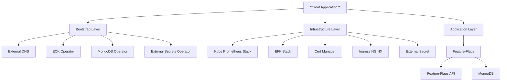
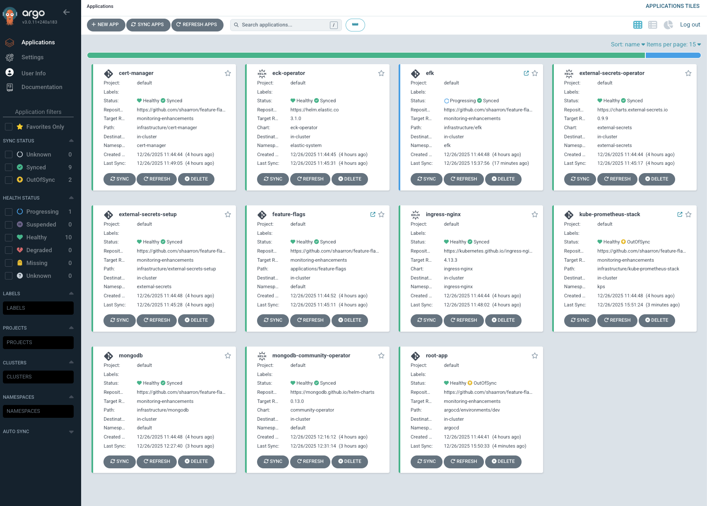
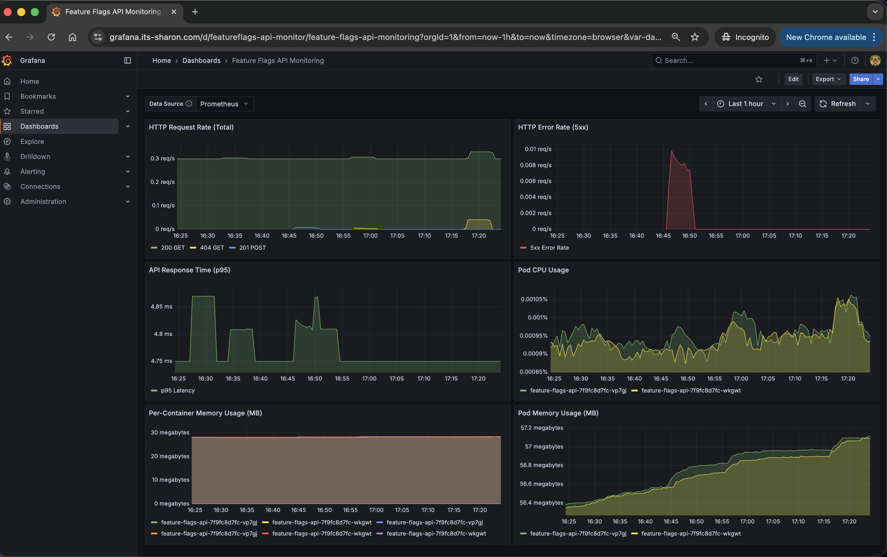
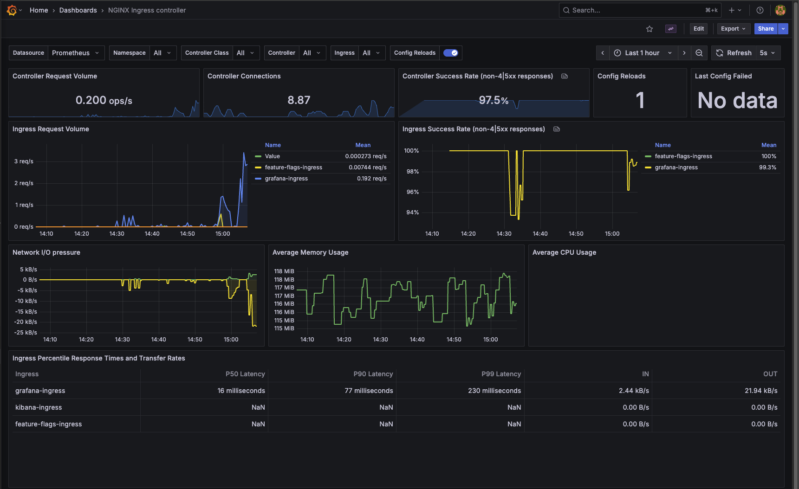
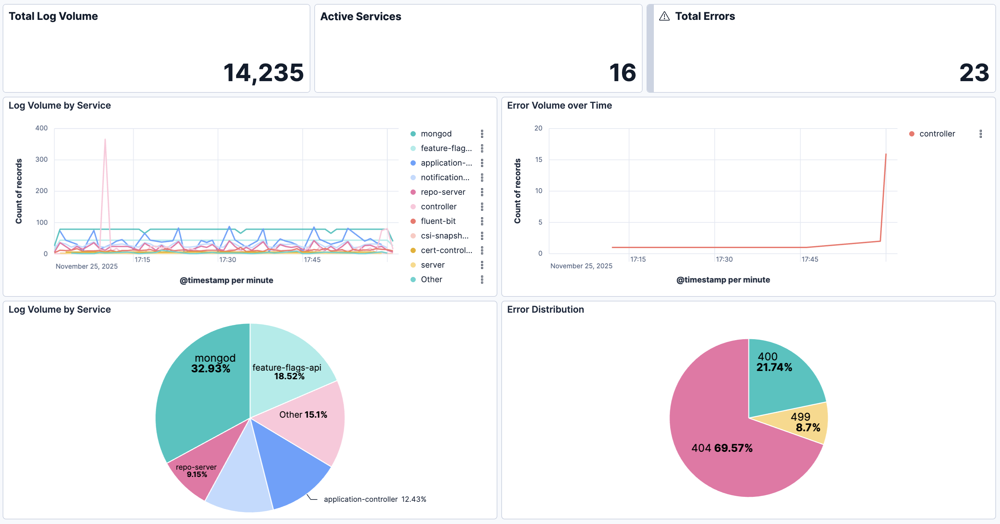

# Feature Flags Resources

This repository contains the **Kubernetes infrastructure manifests** for deploying [**Feature Flags App**](https://github.com/shaarron/feature-flags-app).

**Feature Flags App** runs on **Amazon EKS** with a **one cluster per environment** model, managed by **Argo CD** and **Helm**, following GitOps principles using the **App-of-Apps** pattern. IAM authentication uses **EKS Pod Identity** (no IRSA).

**Components overview**
- **Core App**: Feature Flags API (with MongoDB)
- **Ingress Controller**: NGINX Ingress Controller
- **DNS**: ExternalDNS (AWS Route53)
- **Secrets Management**: External Secrets Operator
- **Certificate Management**: Cert-Manager
- **Monitoring**: Kube-Prometheus-Stack (Prometheus, Grafana)
- **Logging**: EFK Stack (Elasticsearch, Fluent Bit, Kibana)


## Table Of Contents
- **[Architecture](#architecture)**
- **[Argocd Deployment Flow](#argocd-deployment-flow)**
  - **[Argocd Applications Structure](#argocd-applications-structure)**
  - **[Sync waves](#sync-waves)**
  - **[Global Configuration Strategy](#global-configuration-strategy)**
  - **[Argocd Dashboard](#argocd-dashboard)**
- **[Helm Charts](#helm-charts)**
  - **[Application charts](#application-charts)**
  - **[Infrastructure charts](#infrastructure-charts)**
- **[Observability](#observability)**
  - **[Grafana Dashboard: Feature Flags API](#grafana-dashboard-feature-flags-api-monitoring)**
  - **[Grafana Dashboard: Nginx Ingress Controller](#grafana-dashboard-nginx-ingress-controller-dashboard)**
  - **[Kibana Dashboard: Feature Flags API](#kibana-dashboard-feature-flags-dashboard)**
- **[Prerequisites](#prerequisites)**
  - **[AWS Secrets Manager](#aws-secrets-manager)**
  - **[EKS Pod Identity Associations](#eks-pod-identity-associations)**
- **[Deploy Locally](#deploy-locally)**

## Architecture

This project uses a **multi-cluster, one cluster per environment** model. Each environment (dev, staging, prod) runs on a dedicated EKS cluster. ArgoCD is deployed per cluster and bootstrapped with its own root application.

```
Cluster: dev     → root-dev.yaml     → argocd/chart/  (values: environments/dev/values.yaml)
Cluster: staging → root-staging.yaml → argocd/chart/  (values: environments/staging/values.yaml)
Cluster: prod    → root-prod.yaml    → argocd/chart/  (values: environments/prod/values.yaml)
```

**Domains**

| Environment | Base Domain         |
|-------------|---------------------|
| dev         | dev.sharon-k.com    |
| staging     | staging.sharon-k.com|
| prod        | sharon-k.com        |

API ingress host pattern: `backend.<base-domain>`

**IAM Authentication**: All AWS-integrated components (ExternalDNS, External Secrets, Cert-Manager) use **EKS Pod Identity** instead of IRSA. ServiceAccounts are created without `eks.amazonaws.com/role-arn` annotations; IAM role binding is managed via `aws eks create-pod-identity-association`.

## Argocd Deployment Flow


```mermaid
graph TD
  A[**Root Application**] --> B[Bootstrap Layer]
  B --> B1[External DNS]
  B --> B2[ECK Operator]
  B --> B3[MongoDB Operator]
  B --> B4[External Secrets Operator]

  A --> C[Infrastructure Layer]
  C --> C1[Kube Prometheus Stack]
  C --> C2[EFK Stack]
  C --> C4[Cert Manager]
  C --> C5[Ingress NGINX]
  C --> C6[External Secret]

  A --> D[Application Layer]
  D --> D1[Feature-Flags]
  D1 --> D2[Feature-Flags API]
  D1 --> D3[MongoDB]
```

### Argocd Applications Structure

1. **Bootstrap**
   - Install ExternalDNS
   - Install ECK operator + CRDs
   - Install MongoDB operator + CRDs
   - Install External Secrets operator + CRDs

2. **Infrastructure**
   - Deploy **cert-manager**
   - Deploy **ingress-nginx**
   - Deploy **kube-prometheus-stack**
   - Deploy **EFK**
   - Deploy **external-secret** (ClusterSecretStore configuration)

3. **Applications**
   - Deploy **feature-flags** (Umbrella chart bundling **Feature-Flags API** and **MongoDB**)


### Sync waves

| Component                  | Namespace          | Sync Wave | Notes |
|----------------------------|--------------------|-----------|-------|
| External DNS               | `external-dns`     | `1`       | Registers DNS records in Route53 |
| MongoDB Operator           | `default`          | `1`       | Installs MongoDB Community Operator |
| ECK Operator               | `elastic-system`   | `1`       | Deploys ECK operator (Elasticsearch & Kibana) |
| External Secrets Operator  | `external-secrets` | `1`       | Installs External Secrets Operator |
| Cert Manager               | `cert-manager`     | `1`       | Installs Cert-Manager controller and ClusterIssuers |
| Ingress NGINX              | `ingress-nginx`    | `1`       | Deploys Ingress NGINX controller |
| External Secret            | `external-secrets` | `2`       | Configures the AWS ClusterSecretStore |
| Kube Prometheus Stack      | `kps`              | `2`       | Metrics stack (Prometheus, Grafana, etc.) |
| EFK Stack                  | `efk`              | `2`       | Fluent Bit → Elasticsearch → Kibana |
| Feature Flags              | `default`          | `3`       | Umbrella chart: API + MongoDB |


### Global Configuration Strategy

This repository uses a **layered configuration pattern**:

- `argocd/environments/values.yaml` — shared defaults (repository, region, hosted zone)
- `argocd/environments/<env>/values.yaml` — per-environment overrides (domain, image tag, replica count, targetRevision)

The App-of-Apps pattern is implemented as a **single shared Helm chart** at `argocd/chart/` (rather than directory recursion). The chart renders all child ArgoCD `Application` CRDs from templates, driven by per-environment values. This allows `targetRevision` to be controlled per environment without duplicating Application manifests.

The root app (`root-<env>.yaml`) points at this chart and passes its env-specific values file, which controls which git branch all child apps track:

```yaml
# root-dev.yaml
source:
  path: argocd/chart
  helm:
    valueFiles:
      - ../environments/values.yaml
      - ../environments/dev/values.yaml
```

```yaml
# argocd/environments/dev/values.yaml
targetRevision: main   # change this to point dev at any branch
```

## Helm Charts

### Application charts

- [feature-flags-stack](applications/feature-flags-stack/)
  Umbrella chart bundling **Feature-Flags API** and **MongoDB** for deploying the full feature flags stack.

- [feature-flags-api](applications/feature-flags-api/)
  The main feature flags application API. Includes Deployment, Service, Ingress, ConfigMap, and ServiceAccount. HPA and NetworkPolicy are included but disabled by default.

### Infrastructure charts

- [Cert-manager](infrastructure/cert-manager/)
  Manages TLS certificates via Let's Encrypt and Route53 DNS-01 challenge. Creates a ClusterIssuer and wildcard certificate.

- [EFK](infrastructure/efk/)
  Complete logging stack: Elasticsearch, Fluent Bit, and Kibana. Fluent Bit collects logs from all pods and forwards them to Elasticsearch.

- [External-secret](infrastructure/external-secret/)
  Configures the `ClusterSecretStore` pointing at AWS Secrets Manager. Authentication uses EKS Pod Identity (no `auth.jwt` block).

- [ExternalDNS](infrastructure/external-dns/)
  Watches Ingress and Service resources and creates/updates Route53 DNS records automatically.

- [Kube-prometheus-stack](infrastructure/kube-prometheus-stack/)
  Prometheus, Grafana, and Alertmanager. Pre-configured with custom dashboards for the Feature Flags API and Nginx Ingress Controller.

- [Mongodb](infrastructure/mongodb/)
  MongoDBCommunity custom resource. Deployed as a sub-chart dependency of the `feature-flags-stack` umbrella chart.


## Prerequisites

Before deploying, the following must exist in your AWS account.

### AWS Secrets Manager

All secrets are stored under a single secret per environment, keyed as `feature-flags/<env>` (e.g. `feature-flags/dev`, `feature-flags/staging`, `feature-flags/prod`).

The secret must contain the following key/value pairs:

| Key                          | Used by               | Description                              |
|------------------------------|-----------------------|------------------------------------------|
| `MONGO_INITDB_ROOT_PASSWORD` | MongoDB, Feature Flags API | MongoDB root user password          |
| `APP_USER_PASSWORD`          | MongoDB, Feature Flags API | MongoDB application user password   |
| `admin-user`                 | Grafana               | Grafana admin username (when `grafana.externalSecrets.enabled: true`) |
| `admin-password`             | Grafana               | Grafana admin password (when `grafana.externalSecrets.enabled: true`) |

Example (AWS CLI):
```sh
aws secretsmanager create-secret \
  --name feature-flags/dev \
  --secret-string '{
    "MONGO_INITDB_ROOT_PASSWORD": "<value>",
    "APP_USER_PASSWORD": "<value>",
    "admin-user": "admin",
    "admin-password": "<value>"
  }'
```

### EKS Pod Identity Associations

All AWS-integrated components authenticate via EKS Pod Identity. The following associations must be created before deploying (Terraform handles this — listed here for reference):

| Service Account               | Namespace          | IAM Role Purpose                        |
|-------------------------------|--------------------|-----------------------------------------|
| `external-secrets-sa`         | `external-secrets` | Read secrets from AWS Secrets Manager   |
| `external-dns`                | `external-dns`     | Manage Route53 DNS records              |
| `cert-manager`                | `cert-manager`     | DNS-01 challenge via Route53            |

```sh
aws eks create-pod-identity-association \
  --cluster-name <cluster-name> \
  --namespace external-secrets \
  --service-account external-secrets-sa \
  --role-arn arn:aws:iam::<account-id>:role/<role-name>
```


## ArgoCD Dashboard




## Observability

### Grafana Dashboard: Feature Flags API Monitoring



| **Panel** | **Metric Query** | **Description** |
|:---|:---|:---|
| **HTTP Request Rate** | `sum by (status, method, handler) (rate(flask_http_request_total[5m]))` | Rate of incoming HTTP requests over the last 5 minutes. |
| **HTTP Error Rate (5xx)** | `sum(rate(flask_http_request_total{status=~"5.."}[5m]))` | Rate of server-side errors. |
| **Response Time (p95)** | `histogram_quantile(0.95, sum(rate(flask_http_request_duration_seconds_bucket[5m])) by (le))` | 95th percentile response time. |
| **Pod CPU Usage** | `avg by (pod) (rate(container_cpu_usage_seconds_total{pod=~"feature-flags-api-.*", image!="", container!="POD"}[5m]))` | Average CPU utilization per pod. |
| **Pod Memory Usage (MB)** | `avg by (pod) (container_memory_usage_bytes{pod=~"feature-flags-api-.*", container!="POD"} / 1024 / 1024)` | Average memory usage per pod. |
| **Platform Activity: Create vs. Update** | `sum by (method) (increase(flask_http_request_total{method=~"POST/PUT"}[$__range]))` | Distribution of POST vs PUT operations. |

### Grafana Dashboard: Nginx Ingress Controller Dashboard



### Kibana Dashboard: Feature Flags Dashboard



## Deploy Locally

```sh
# Install Argo CD (if not already installed)
kubectl create namespace argocd
kubectl apply -n argocd -f https://raw.githubusercontent.com/argoproj/argo-cd/stable/manifests/install.yaml

# Apply the root app for your target environment
kubectl apply -f argocd/root-dev.yaml -n argocd

# Verify
kubectl get ns
kubectl get pods -A
kubectl get ingress -A
```

### Login to ArgoCD CLI

```sh
kubectl -n argocd get secret argocd-initial-admin-secret \
  -o jsonpath="{.data.password}" | base64 -d; echo

argocd login localhost:8080 --username admin --password <PASSWORD> --insecure
```

### Login through UI

```sh
kubectl port-forward svc/argocd-server -n argocd 8080:443

kubectl -n argocd get secret argocd-initial-admin-secret \
  -o jsonpath="{.data.password}" | base64 -d; echo

# Open http://localhost:8080 and log in with admin / <password>
```
