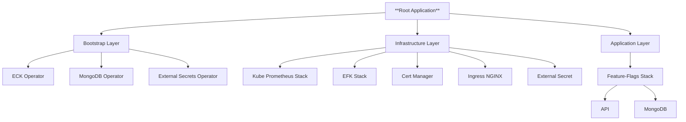

# Feature Flags Resources

This repository contains the **Kubernetes infrastructure manifests** for deploying [**Feature Flags App**](https://github.com/shaarron/feature-flags-app).

**Feature Flags App** running on **Amazon EKS** across dedicated **Dev, Staging, and Production clusters**, managed with **Argo CD** and **Helm**, following a production-grade GitOps workflow using the **App-of-Apps** pattern.

**Components overview**
- **Core App**: Feature Flags API (with MongoDB)
- **Ingress Controller**: NGINX Ingress Controller
- **Secrets Management**: External Secrets Operator (AWS Secrets Manager)
- **Certificate Management**: Cert-Manager (Let's Encrypt via Route53 DNS-01)
- **Monitoring**: Kube-Prometheus-Stack (Prometheus, Grafana)
- **Logging**: EFK Stack (Elasticsearch, Fluent Bit, Kibana)


## Table Of Contents
- **[Argocd Deployment Flow](#argocd-deployment-flow)**
  - **[Argocd Applications Structure](#argocd-applications-structure)**
  - **[Sync waves](#sync-waves)**
  - **[Multi-Cluster Architecture](#multi-cluster-architecture)**
  - **[Global Configuration Strategy](#global-configuration-strategy)**
  - **[Argocd Dashboard](#argocd-dashboard)**
- **[Helm Charts](#helm-charts)**
  - **[Application charts](#application-charts)**
  - **[Infrastructure charts](#infrastructure-charts)**
- **[High Availability](#high-availability)**
- **[Security](#security)**
- **[Observability](#observability)**
  - **[Grafana Dashboard: Feature Flags API](#grafana-dashboard-feature-flags-api-monitoring)**
  - **[Grafana Dashboard: Nginx Ingress Controller](#grafana-dashboard-nginx-ingress-controller-dashboard)**
  - **[Kibana Dashboard: Feature Flags API](#kibana-dashboard-feature-flags-dashboard)**
- **[Deploy Locally](#deploy-locally)**

## Argocd Deployment Flow


```mermaid
graph TD
  A[**Root Application**] --> B[Bootstrap Layer]
  B --> B2[ECK Operator]
  B --> B3[MongoDB Operator]
  B --> B4[External Secrets Operator]

  A --> C[Infrastructure Layer]
  C --> C1[Kube Prometheus Stack]
  C --> C2[EFK Stack]
  C --> C4[Cert Manager]
  C --> C5[Ingress NGINX]
  C --> C6[External Secret]

  A --> D[Application Layer]
  D --> D1[Feature-Flags Stack]
  D1 --> D2[API]
  D1 --> D3[MongoDB]
```

### Argocd Applications Structure

1. **Bootstrap**
   - Install ECK operator + crds
   - Install MongoDB operator + crds
   - Install External Secrets operator + crds

2. **Infrastructure**
   - Deploy **kube-prometheus-stack**
   - Deploy **EFK**
     - [ECK](https://www.elastic.co/docs/deploy-manage/deploy-manage/deploy/cloud-on-k8s) (**Elastic Cloud Kubernetes** - for Elasticsearch & kibana)
     - Fluent Bit
   - Deploy **Ingress NGINX**
   - Deploy **external-secret** (ClusterSecretStore configuration)
   - Deploy **cert-manager**

3. **Applications**
   - Deploy **Feature-Flags Stack** (Umbrella chart bundling **API** and **MongoDB**)


### Sync waves

| Component               | Namespace        | Sync Wave | Notes |
|-------------------------|------------------|-----------|-------|
| MongoDB Operator       | `mongodb`        | `1`       | Installs MongoDB Community Operator |
| ECK Operator           | `elastic-system` | `1`       | Deploys ECK operator(Elasticsearch & Kibana) |
| External Secrets Operator | `external-secrets` | `1` | Installs External Secrets Operator |
| Cert Manager           | `cert-manager` | `1`       | Installs Cert-Manager controller and ClusterIssuers for TLS management |
| Ingress NGINX           | `ingress-nginx` | `1`       | Deploys Ingress NGINX controller |
| External Secret                |  `external-secrets`| `2`       | Configures the AWS `ClusterSecretStore` configuration |
| Kube Prometheus Stack  | `kps`            | `2`       | Metrics stack (Prometheus, Grafana, etc.) |
| EFK Stack              | `efk`            | `2`       | Fluent Bit → Elasticsearch → Kibana |
| Feature Flags Stack    | `default-{env}`  | `3`       | Umbrella chart: API + MongoDB (Internal ordering via InitContainers) |


### Multi-Cluster Architecture

This stack is deployed across **dedicated EKS clusters per environment** (Dev, Staging, Production). Each cluster runs a full, isolated copy of all operators and infrastructure components — there is no shared control plane between environments.

This design is a deliberate architectural choice driven by the use of cluster-scoped operators (Cert-Manager, ECK, External Secrets Operator). Deploying these on separate physical clusters eliminates CRD version conflicts, webhook collisions, and cross-environment blast radius. A change in Dev cannot destabilize Staging or Production.

**Note for Single-Cluster Evaluation:** If evaluating this project on a single cluster (like Minikube or a single shared EKS cluster), apply only **one** environment root app (e.g., `kubectl apply -f argocd/root-dev.yaml`). Applying multiple environments to the same cluster will cause cluster-scoped operators to collide.

### Global Configuration Strategy

This repository uses a **centralized configuration pattern**. A single values file overrides settings across all applications and infrastructure components (like domains, regions, and secrets) to ensure consistency.

**Source of Truth:** [`argocd/environments/values.yaml`](argocd/environments/values.yaml)

### How it Works
Argo CD Applications reference the global values file using `valueFiles`.

**Example:**
```yaml
source:
  helm:
    valueFiles:
    - ../../argocd/environments/values.yaml  # References the global config
```

## Helm Charts

### Infrastructure charts

- [Cert-manager](infrastructure/cert-manager/)
Manages TLS certificates for Kubernetes applications. Automatically provisions and renews certificates from Let's Encrypt using a DNS-01 solver via AWS Route53. The `ClusterIssuer` is named `letsencrypt-production` and is referenced directly by Kibana and Grafana ingress annotations.

- [EFK](infrastructure/efk/)
Complete logging stack combining Elasticsearch, Fluent Bit, and Kibana. Fluent Bit collects logs from all pods, forwards them to Elasticsearch for indexing, and Kibana provides a web UI for log analysis and visualization. The Kibana index template is provisioned as code via a post-install Job, ensuring correct numeric field mappings for dashboard queries on first deploy.

- [External-secret](infrastructure/external-secret/)
Configures the ClusterSecretStore and required ServiceAccount resources for External Secrets integration. Enables secure integration with AWS Secrets Manager, ensuring no secrets are stored in Git. The External Secrets Operator is deployed separately in the bootstrap layer.

- [Kube-prometheus-stack](infrastructure/kube-prometheus-stack/)
Comprehensive monitoring solution including Prometheus for metrics collection, Grafana for visualization, and Alertmanager for alerting. The Feature Flags API Grafana dashboard is provisioned automatically via a ConfigMap, treating monitoring configuration as code.

- [Mongodb](infrastructure/mongodb/)
Provides the persistent data store for the Feature Flags application. While the chart source is located in `infrastructure/`, it is deployed as a sub-chart (dependency) of the `feature-flags-stack` application.

### Application charts

- [Feature-Flags Stack](applications/feature-flags-stack/)
Umbrella chart bundling **API** and **MongoDB** for deploying the full feature flags stack.

- [Feature-Flags API](applications/feature-flags-api/)
The main feature flags application API. Configured with Pod Anti-Affinity, Topology Spread Constraints, and Horizontal Pod Autoscaling for production-grade availability.


## ArgoCD Dashboard

This screenshot demonstrates the **App-of-Apps** pattern in action for the Feature Flags project. It visualizes the real-time hierarchy and health status of the entire stack.


## High Availability

The API and data tiers are both configured for resilience against node and zone failures.

**API (Feature Flags API):**
- **Pod Anti-Affinity** - prevents multiple API replicas from being co-located on the same node.
- **Topology Spread Constraints** - distributes pods evenly across availability zones.
- **Horizontal Pod Autoscaler (HPA)** - automatically scales replicas based on CPU/memory load.

**Data (MongoDB):**
- Staging and Production environments deploy a **3-node MongoDB ReplicaSet**, providing automatic primary election and read scalability.
- Dev uses a single-node replica for cost efficiency while maintaining schema and operator parity with upper environments.


## Security

The stack applies a defence-in-depth security posture at both the container and network layers.

**Container Security:**
- All API containers run with `runAsNonRoot: true` and a `readOnlyRootFilesystem`, minimising the attack surface of each pod.
- All Linux capabilities are dropped (`capabilities.drop: ["ALL"]`), with no capabilities added back.

**Secret Management:**
- Secrets are never stored in Git. All sensitive values (database credentials, API keys) are sourced at runtime from **AWS Secrets Manager** via the External Secrets Operator.

**Network Policy:**
- NetworkPolicies are enforced to restrict inter-pod traffic, ensuring that only explicitly permitted communication paths are allowed within the cluster.


## Observability

### Grafana Dashboard: Feature Flags API Monitoring

This Grafana dashboard monitors the Feature Flags API on Kubernetes.
Provisioned via the `kube-prometheus-stack` Helm chart (ConfigMap: `feature-flags-api-grafana-dashboard`), it combines Flask app metrics (`prometheus_flask_exporter`) with Kubernetes metrics from Prometheus to visualize traffic, performance, and resource usage.


| **Panel** | **Metric Query** | **Description** |
|:---|:---|:---|
| **HTTP Request Rate** | `sum by (status, method, handler) (rate(flask_http_request_total[5m]))` | Displays the rate of incoming HTTP requests handled by the Flask API over the last 5 minutes. |
| **HTTP Error Rate (5xx)** | `sum(rate(flask_http_request_total{status=~"5.."}[5m]))` | Shows the rate of server-side errors (5xx) to detect application or backend failures. |
| **Response Time (p95)** | `histogram_quantile(0.95, sum(rate(flask_http_request_duration_seconds_bucket[5m])) by (le))` | Indicates the 95th percentile response time of API requests. |
| **Pod CPU Usage** | `avg by (pod) (rate(container_cpu_usage_seconds_total{pod=~"feature-flags-api-.*", image!="", container!="POD"}[5m]))` | Monitors average CPU utilization of the application containers. |
| **Pod Memory Usage (MB)** | `avg by (pod) (container_memory_usage_bytes{pod=~"feature-flags-api-.*", container!="POD"} / 1024 / 1024)` | Monitors average memory usage per pod in megabytes. |
| **Platform Activity: Create vs. Update** | `sum by (method) (increase(flask_http_request_total{method=~"POST/PUT"}[$__range]))` | Displays the distribution of state-changing operations (POST vs PUT) to monitor user engagement (creating new flags vs updating existing ones). |


### Grafana Dashboard: Nginx Ingress Controller Dashboard

This dashboard is based on the official [NGINX Ingress Controller dashboard (ID: 9614)](https://grafana.com/grafana/dashboards/9614-nginx-ingress-controller/). It provides comprehensive visibility into the ingress traffic, performance, and controller status.


### Kibana Dashboard: Feature Flags Dashboard

The dashboard, titled "Feature Flags Dashboard", focuses on high-level log volume, service activity, and error rates, particularly targeting feature flags application common log fields like HTTP status codes (`status`/`code`) and Python/standard logging levels (`levelname`).


#### Dashboard Panels Overview

The dashboard is structured into several panels for immediate observability into log health and volume.

| Panel Type | Title | Data Source / Metric | Filtering Logic |
| :--- | :--- | :--- | :--- |
| **Metric** | **Total Log Volume** | Count of all log records. | None (All logs). |
| **Metric** | **Active Services** | Unique count of `kubernetes.container_name.keyword`. | Filtered to records where `kubernetes.container_name.keyword` exists. |
| **Metric** | **Total Errors** | Count of records. | **Filter:** `levelname: ERROR` **OR** `status >= 400` **OR** `code >= 400`. |
| **Time Series** | **Log Volume by Service** | Log count over time. | Split by the **Top 10** `kubernetes.container_name.keyword` values. |
| **Time Series** | **Error Volume over Time** | Log count over time. | **Filter:** `levelname: ERROR` **OR** `status >= 400` **OR** `code >= 400`. Split by the **Top 10** error sources. |
| **Pie Chart** | **Log Volume by Service** | Count of records, aggregated by service. | Top 5 `kubernetes.container_name.keyword` values. |
| **Pie Chart** | **Error Distribution** | Count of records, aggregated by code. | **Filter:** `code >= 400` **OR** `status >= 400`. Grouped by `code` field ranges. |

#### Technical Implementation Details

##### 1. Global Filter: Kubernetes Metadata Required
The dashboard applies a **Global Filter** requiring the existence of the field `kubernetes.container_name.keyword`.
* **Implication:** Only logs originating from Kubernetes containers will be visible. Logs shipped from external sources (e.g., VMs, bare metal) without this specific metadata field will be automatically filtered out.

##### 2. Index Template & Data Types
The dashboard relies on the specific mappings defined in the `index_template.json` to function correctly.
* **Numeric Fields (`short`/`integer`):** Fields like `status`, `code`, and `latency_ms` are explicitly mapped as numeric types. This allows the dashboard to perform range queries (e.g., `status >= 400`) and aggregations. If these were mapped as default strings, the error rate logic would fail.
* **Keyword Fields:** Fields like `levelname` and `kubernetes.container_name` use the `keyword` type, which is required for the "Top 10" bucket aggregations used in the visualization splits.

## Deploy Locally


```sh
# Install Argo CD (if not already installed)
kubectl create namespace argocd

kubectl apply -n argocd -f https://raw.githubusercontent.com/argoproj/argo-cd/stable/manifests/install.yaml

# Apply the root app (example with dev)
kubectl apply -f argocd/root-dev.yaml -n argocd

# Verify
kubectl get ns
kubectl get pods -A
kubectl get ingress -A

```

### Login to argocd CLI

```sh
# Get the password
kubectl -n argocd get secret argocd-initial-admin-secret \
  -o jsonpath="{.data.password}" | base64 -d; echo

# Login with the password from above
argocd login localhost:8080 --username admin --password <PASSWORD> --insecure
```
### Login through UI
```sh
# Port forward
 kubectl port-forward svc/argocd-server -n argocd 8080:443

# Get the password
kubectl -n argocd get secret argocd-initial-admin-secret \
  -o jsonpath="{.data.password}" | base64 -d; echo

# Open argocd UI
# Login with admin user and the retrieved password
http://localhost:8080

```
